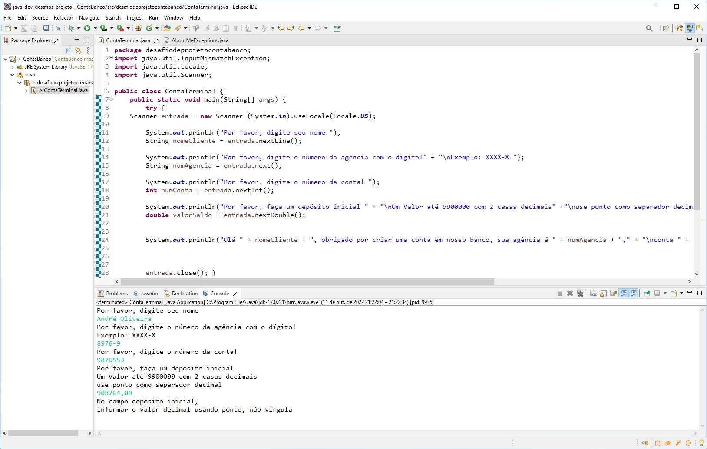

# 🧩 Desafio de projeto Sintaxe básica Java - [DIO](https://web.dio.me/) Formação Java Developer ☕
Nesse desafio de projeto, a proposta é criar uma classe que possa receber alguns dados pelo terminal (simulando uma conta bancária) e gerar uma saída também pelo terminal, como uma forma de exercitar o que foi aprendido no módulo de sintaxe de Java - [Link do desafio](https://github.com/digitalinnovationone/trilha-java-basico/tree/main/desafios/sintaxe)
Para esse código, revisei sobre regras de declaração de variáveis, terminal, método main, classe Scanner, concatenação e classe String.

Adicionei o método **useLocale** para padronizar o uso do ponto como separador decimal

Na proposta do desafio não havia validações de entrada, apenas a captura das informações que o usuário digita, a atribuição em uma variável e a saída no terminal da frase padrão sugerida.

Mas após ver a aula sobre tratamento de exceções em Java, achei que seria bom praticar usando nesse código uma instrução **try-catch** para a possibilidade do usuário digitar uma vírgula como separador decimal  😊

Abaixo um print do código executado, onde eu digitei o valor do campo "depósito inicial" com vírgula propositalmente para ver o resultado do tratamento da exceção:
